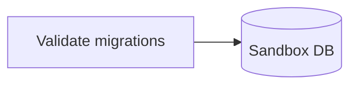
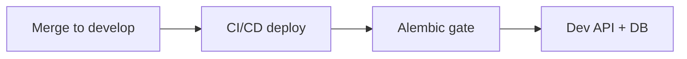
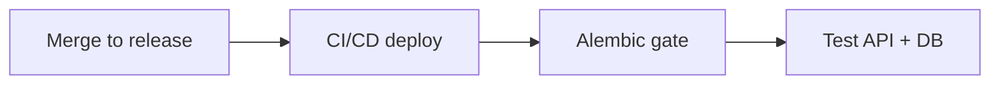
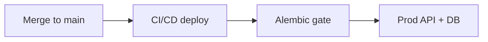

# Alembic Migration Workflow

Deployment workflow diagram for Alembic-driven schema changes.

## Table of Contents
- [Diagram](#diagram)

## Diagram

### Sandbox

Sandbox validation runs via `scripts/dev/validate_migrations.py` against temporary schema `mnemosys_sandbox`.
Branch: feature/bugfix/hotfix (manual).

### Development

Branch: `develop` -> environment `development`. Database: `mnemosys_dev`.

### Test

Branch: `release` -> environment `test`. Database: `mnemosys_test`.

### Production

Branch: `main` -> environment `production`. Database: `mnemosys_prod`.
