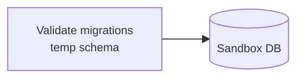
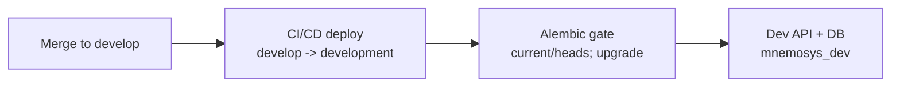
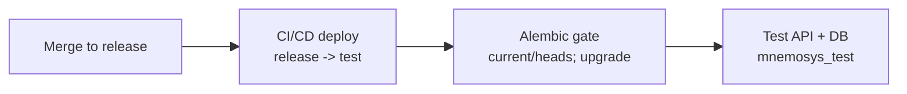
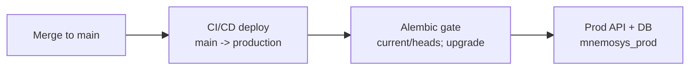

# Alembic Migration Workflow

Deployment workflow diagram for Alembic-driven schema changes.

## Table of Contents
- [Diagram](#diagram)

## Diagram

### Sandbox

Sandbox validation runs via `scripts/dev/validate_migrations.py` against temporary schema `mnemosys_sandbox`.

### Development

### Test

### Production

