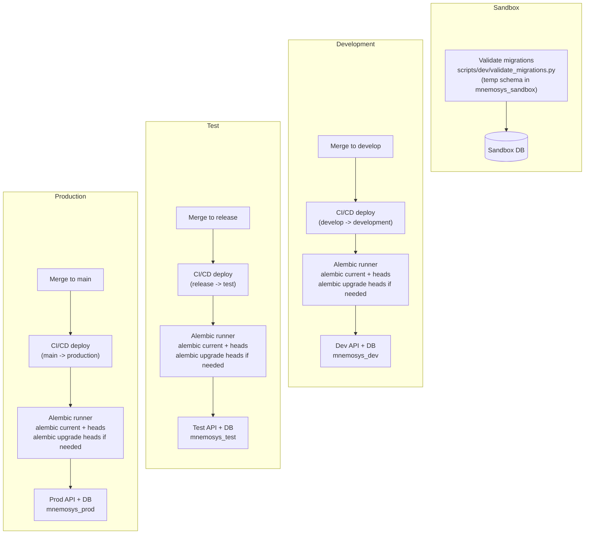

# Alembic Migration Workflow

Deployment workflow diagram for Alembic-driven schema changes.

## Table of Contents
- [Diagram](#diagram)

## Diagram

```mermaid
flowchart TB
  classDef ghost fill:transparent,stroke:transparent,color:transparent;

  subgraph Sandbox
    direction LR
    SB_ANCHOR(( ))
    SBV["Validate migrations<br/>scripts/dev/validate_migrations.py<br/>(temp schema in mnemosys_sandbox)"]
    SB[(Sandbox DB)]
    SBV --> SB
    SB_ANCHOR --- SBV
  end

  subgraph Development
    direction LR
    DEV_ANCHOR(( ))
    DEV["Merge to develop"]
    DEV_PIPE["CI/CD deploy<br/>(develop -> development)"]
    DEV_GATE["Alembic runner<br/>alembic current + heads<br/>alembic upgrade heads if needed"]
    DEV_APP["Dev API + DB<br/>mnemosys_dev"]
    DEV --> DEV_PIPE --> DEV_GATE --> DEV_APP
    DEV_ANCHOR --- DEV
  end

  subgraph Test
    direction LR
    REL_ANCHOR(( ))
    REL["Merge to release"]
    TEST_PIPE["CI/CD deploy<br/>(release -> test)"]
    TEST_GATE["Alembic runner<br/>alembic current + heads<br/>alembic upgrade heads if needed"]
    TEST_APP["Test API + DB<br/>mnemosys_test"]
    REL --> TEST_PIPE --> TEST_GATE --> TEST_APP
    REL_ANCHOR --- REL
  end

  subgraph Production
    direction LR
    MAIN_ANCHOR(( ))
    MAIN["Merge to main"]
    PROD_PIPE["CI/CD deploy<br/>(main -> production)"]
    PROD_GATE["Alembic runner<br/>alembic current + heads<br/>alembic upgrade heads if needed"]
    PROD_APP["Prod API + DB<br/>mnemosys_prod"]
    MAIN --> PROD_PIPE --> PROD_GATE --> PROD_APP
    MAIN_ANCHOR --- MAIN
  end

  SB_ANCHOR --> DEV_ANCHOR --> REL_ANCHOR --> MAIN_ANCHOR

  class SB_ANCHOR,DEV_ANCHOR,REL_ANCHOR,MAIN_ANCHOR ghost;
  linkStyle 1 stroke:transparent,stroke-width:0px;
  linkStyle 5 stroke:transparent,stroke-width:0px;
  linkStyle 9 stroke:transparent,stroke-width:0px;
  linkStyle 13 stroke:transparent,stroke-width:0px;
  linkStyle 14 stroke:transparent,stroke-width:0px;
  linkStyle 15 stroke:transparent,stroke-width:0px;
  linkStyle 16 stroke:transparent,stroke-width:0px;
```
