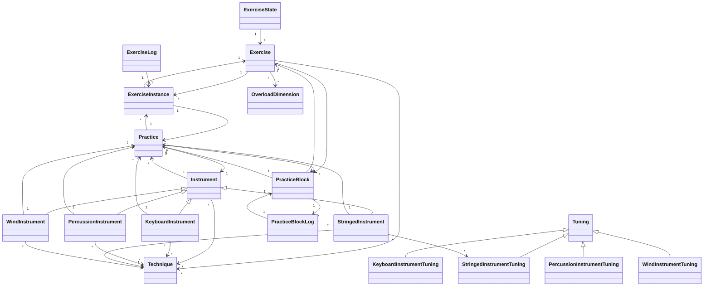

# MNEMOSYS Data Model

Auto-generated diagram showing entity relationships.

```mermaid
classDiagram

    %% === Exercise Group ===
    class Exercise
    class ExerciseInstance
    class ExerciseLog
    class ExerciseState

    %% === Instrument Group ===
    class Instrument
    class KeyboardInstrument
    class PercussionInstrument
    class StringedInstrument
    class WindInstrument

    %% === Practice Group ===
    class Practice
    class PracticeBlock
    class PracticeBlockLog

    %% === Tuning Group ===
    class KeyboardInstrumentTuning
    class PercussionInstrumentTuning
    class StringedInstrumentTuning
    class Tuning
    class WindInstrumentTuning

    %% === Connector Entities ===
    class OverloadDimension
    class Technique

    %% Inheritance relationships
    Instrument <|-- KeyboardInstrument
    Instrument <|-- PercussionInstrument
    Instrument <|-- StringedInstrument
    Instrument <|-- WindInstrument
    Tuning <|-- KeyboardInstrumentTuning
    Tuning <|-- PercussionInstrumentTuning
    Tuning <|-- StringedInstrumentTuning
    Tuning <|-- WindInstrumentTuning

    %% Composition relationships
    Exercise "1" --> "*" ExerciseInstance
    Exercise "1" --> "*" PracticeBlock
    ExerciseInstance "1" --> "1" Exercise
    ExerciseInstance "1" --> "1" Practice
    ExerciseLog "1" --> "1" ExerciseInstance
    ExerciseState "1" --> "1" Exercise
    Instrument "1" --> "*" Practice
    KeyboardInstrument "1" --> "*" Practice
    PercussionInstrument "1" --> "*" Practice
    Practice "1" --> "*" ExerciseInstance
    Practice "1" --> "1" Instrument
    Practice "1" --> "*" PracticeBlock
    PracticeBlock "1" --> "1" Exercise
    PracticeBlock "1" --> "1" Practice
    PracticeBlock "1" --> "*" PracticeBlockLog
    PracticeBlockLog "1" --> "1" PracticeBlock
    StringedInstrument "1" --> "*" Practice
    WindInstrument "1" --> "*" Practice

    %% Association relationships (many-to-many)
    Exercise "*" --> "*" OverloadDimension
    Exercise "*" --> "*" Technique
    Instrument "*" --> "*" Technique
    KeyboardInstrument "*" --> "*" Technique
    PercussionInstrument "*" --> "*" Technique
    StringedInstrument "*" --> "*" StringedInstrumentTuning
    StringedInstrument "*" --> "*" Technique
    WindInstrument "*" --> "*" Technique

```